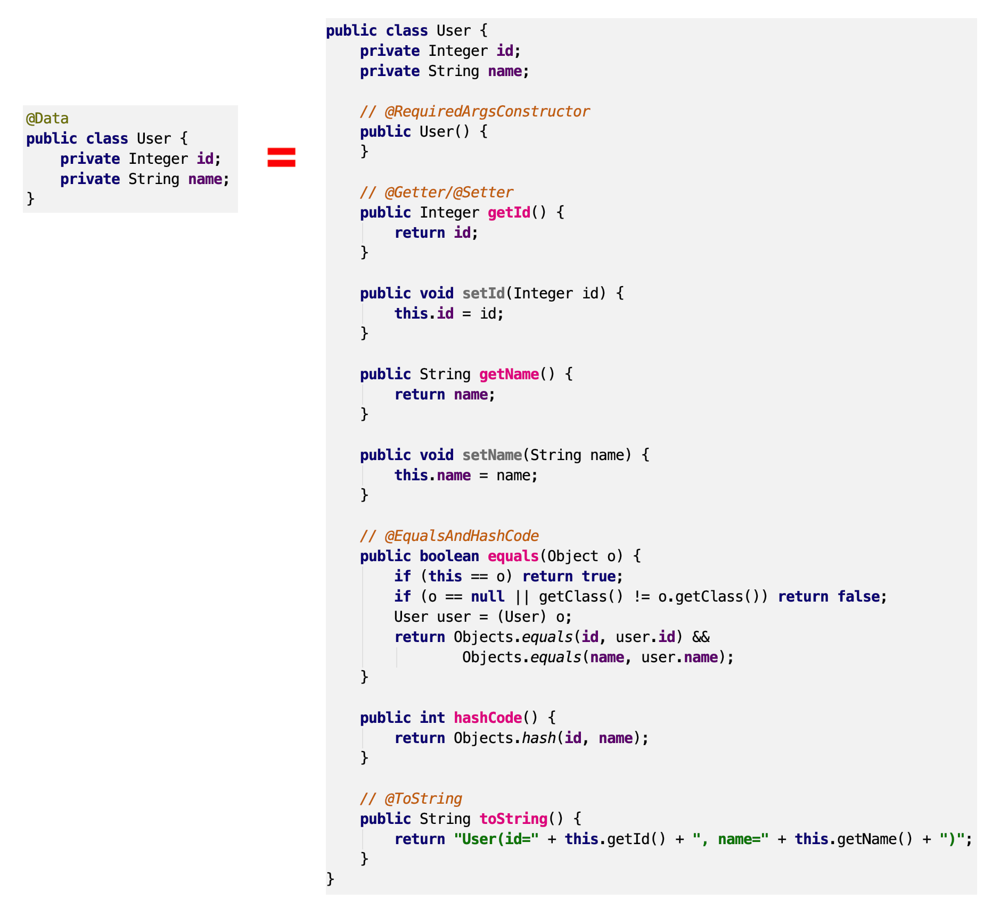
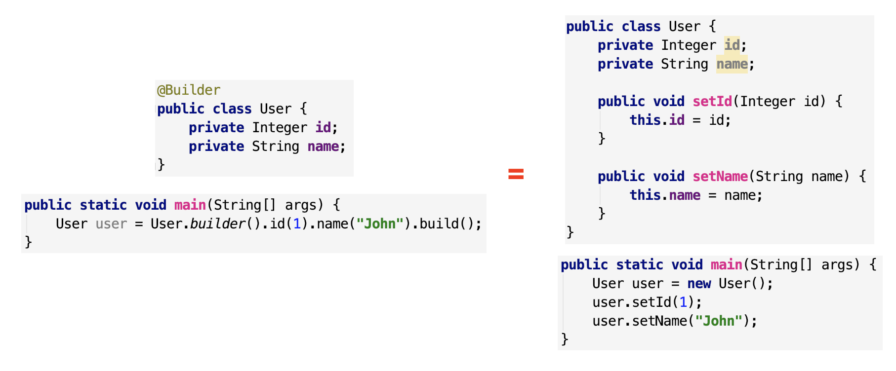

## 加入maven dependency
```
<dependency>
    <groupId>org.projectlombok</groupId>
    <artifactId>lombok</artifactId>
    <version>1.18.12</version>
</dependency>
```
## 在Intellij IDEA 安裝lombok插件
Preferences -> plugins
搜尋 lombok
## 用法
1. @Getter/@Setter

2. @ToString

3. @EqualsAndHashCode

4. @NoArgsConstructor 

5. @AllArgsConstructor

5. @RequiredArgsConstructor

6. @Data

7. Value

8. @Builder

9. @Slf4j

