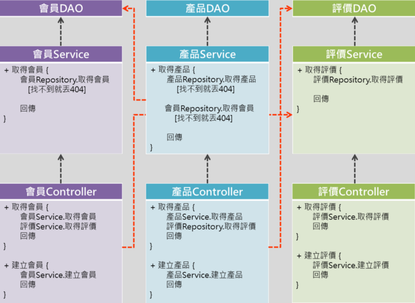
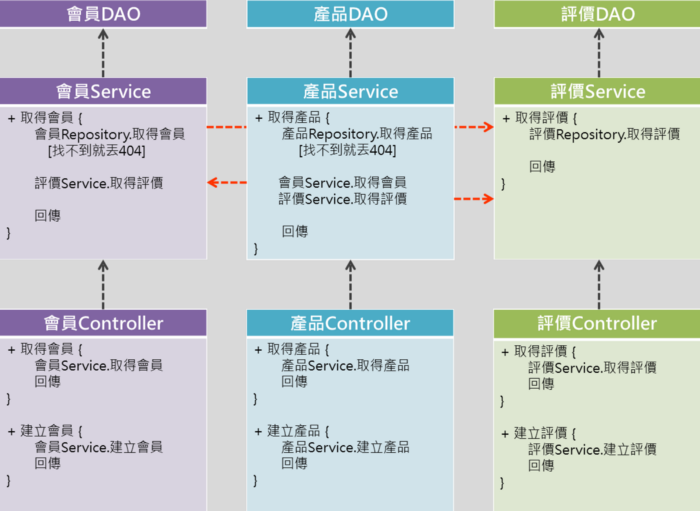

## 加入參考
於pom.xml中加入以下參考
``` xml
<parent>
    <groupId>org.springframework.boot</groupId>
    <artifactId>spring-boot-starter-parent</artifactId>
    <version>2.1.4.RELEASE</version>
<parent>
<dependencies>
    <dependency>
        <groupId>org.springframework.boot</groupId>
        <artifactId>spring-boot-starter-web</artifactId>
    </dependency>
</dependencies>
```
## 加入SpringBootApplication
於專案中新增Application Class
``` java
@SpringBootApplication
public class Application {
    public static void main(String[] args) {
        SpringApplication.run(Application.class,args);
    }
}
```
## 專案打包與執行
於pom.xml中加入<packaging>來描述產出JAR檔
``` xml
<packagin>jar</packagin>
```
加入SpringBoot Maven插件於產生Jar時會被使用到
``` xml
<build>
    <plugins>
        <plugin>
            <groupId>org.springframework.boot</groupId>
            <artifactId>spring-boot-maven-plugin</artifactId>
        </plugin>
    </plugins>
</build>
```
打包指令
``` shell script
mvn clean package
```
執行指令
``` shell script
java -jar JAR檔名稱
```
## REST controller sample
``` java
@RestController
@RequestMapping(value = "/products" produces = MediaType.PPLICATION_JSON_VALUE)
public class ProductController {
@GetMapping("/{id}")
public ResponseEntity<Product> getProduct(@PathVariable("id") String id) {
//...    
return ResponseEntity.ok().body(product);
}

@PostMapping
public ResponseEntity<Product> createProduct(@RequestBody Product request) {
//...    
return ResponseEntity.ok().body(product);
}

@PutMapping("/{id}")
public ResponseEntity<Product> replaceProduct(@PathVariable("id") String id,@RequestBody Product request) {
//...    
return ResponseEntity.ok().body(product);
}                               
}
```
## 元件標記
1. @RestController：標記在用來接收請求與回傳資料的表示層。
2. @Service：標記在負責資料處理的業務邏輯層。
3. @Repository：標記在能與資料庫互動的資料持久層。
4. @Configuration：標記在專門讀取應用程式設定值的類別。
5. @Component：如果一個類別不太好歸類到以上類型，可以使用這個名稱比較通俗的標記，它的中文意思就是「元件」而已。
6. @Bean：標記在方法上，其回傳值將被建立成元件。該方法通常被宣告在Configuration類別中。好處是能自行進行元件的建構。
## 分層依賴關係
### BAD

### GOOD
